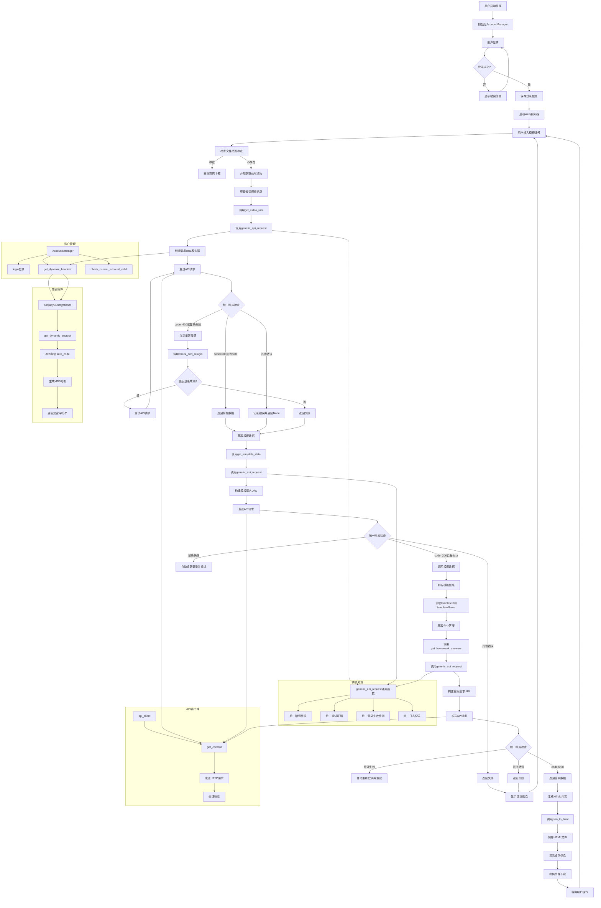

# 新教育智能平台研究项目

本项目是新教育智能平台（[www.xinjiaoyu.com](http://www.xinjiaoyu.com)）的相关研究工具集。

---

## 项目简介

### `src/GetAnswer` 模块


该目录包含基于 PyWebIO 的工具，用于生成作业（智能题卡）答案的 HTML 页面。生成的 HTML 文件可以用于部署静态网站。

**生成效果示例网站：**
- https://xinjiaoyu.laoshui.top/

## 使用指南

### 1. 克隆仓库
```bash
git clone https://github.com/laoshuikaixue/xinjiaoyu.git
cd xinjiaoyu
```

### 2. 安装依赖
```bash
pip install -r requirements.txt
```

### 3. 配置变量
在 `src/GetAnswer/main.py` 文件的主函数中，填写你的用户名和密码，用于后续的请求验证。

> **部分过程：**
> - 2024年12月27日前后，新教育平台增加了登录时的验证码
> - 2024年12月31日晚间，获取 template_id 的API疑似增加了客户端验证，现已改为使用小程序/安卓端请求头
> - 2025年不知何时，新教育加入了动态safefcode，并对Encrypt字段进行验证（加了个寂寞，safefcode解密之后还是jbyxinjiaoyu）
> - 注意：由于设计原因，当前实现需要先通过提交作业接口获取templateCode对应的paperID，因此只能在允许提交作业的时间段内，并且你选修了该门学科的情况下才能获取paperID进行解析

### 4. 运行程序
运行 `main.py` 文件，打开提示的网站地址，访问并提交解码后的题卡二维码内容即可。

## 许可协议

本项目采用 [GPL-3.0](LICENSE) 许可证。

---

## 鸣谢

感谢 [ZhiNengTiKa](https://github.com/LFWQSP2641/ZhiNengTiKa) 项目，本项目的代码参考了其加密和鉴权部分的实现。

## 数据获取流程图

